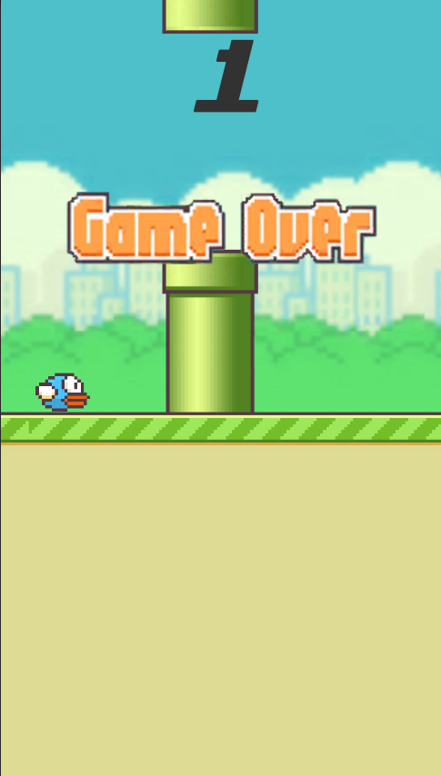

# Flappy-Bird

This is a Unity-based clone of the Flappy Bird game, created to demonstrate how to develop a similar 2D game using the Unity engine.

## Game Introduction:
Compared to the original version of the game, random obstacles moving up and down were added. It's almost a 1:1 reproduction of the original. You can add your own ideas to enrich this game according to my project, or you can reconstruct this project according to the material package and code I provided to understand the logic of Unity2D game.

## Game Screenshots
<table>
  <tr>
    <td>
      
    </td>
    <td>
      
    </td>
    <td>
      
    </td>
  </tr>
</table>

## Material pack
[Flappy bird unitypackage](Material/flappy_bird.unitypackage)